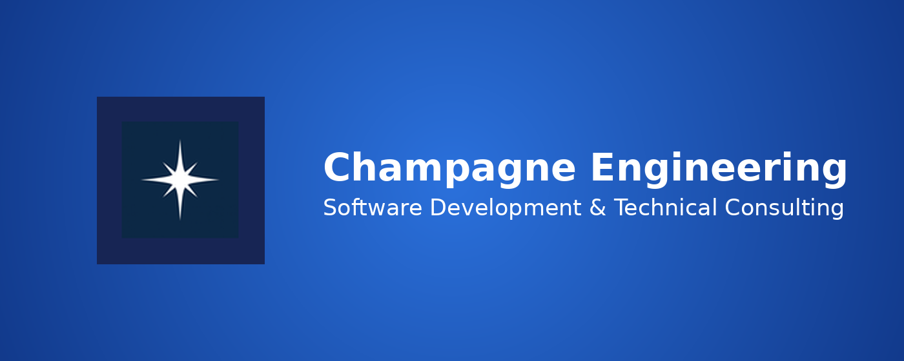
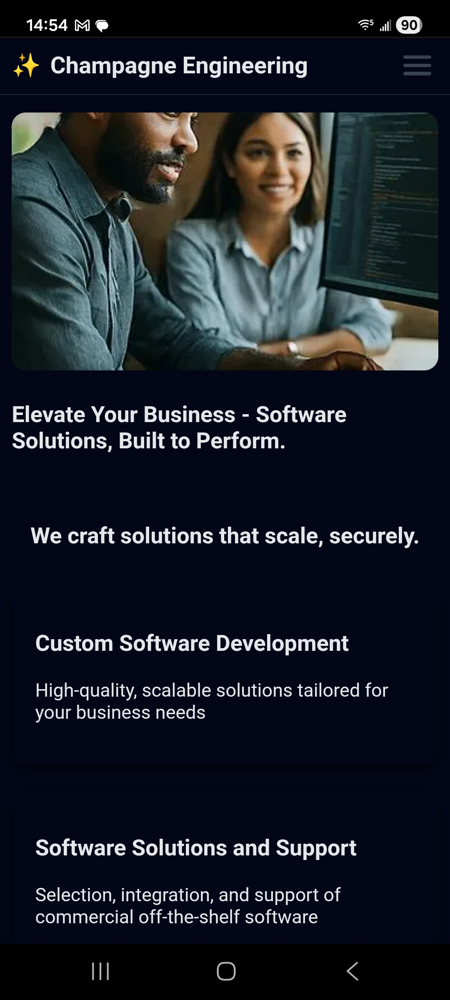
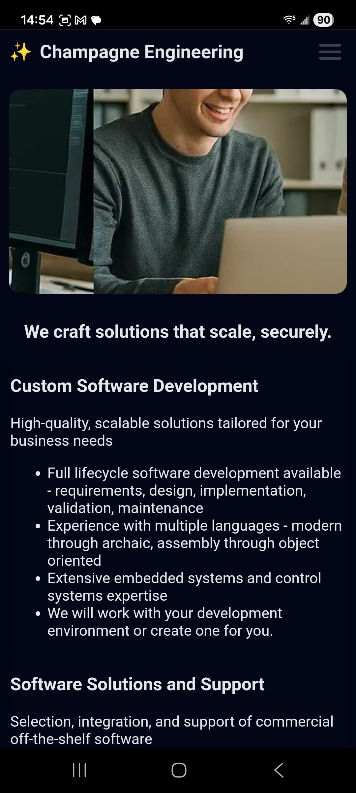
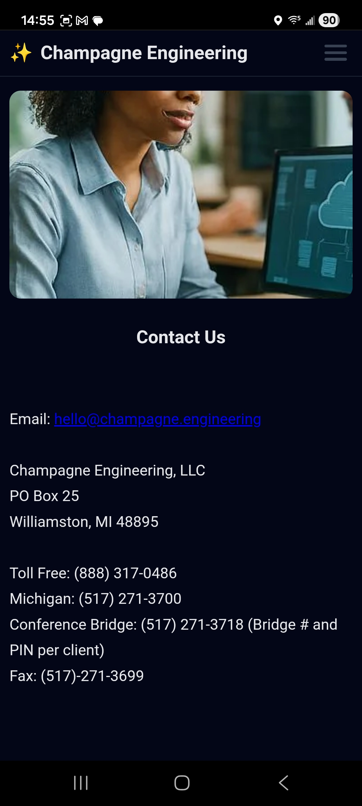
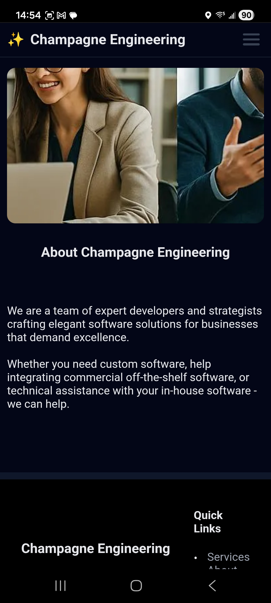
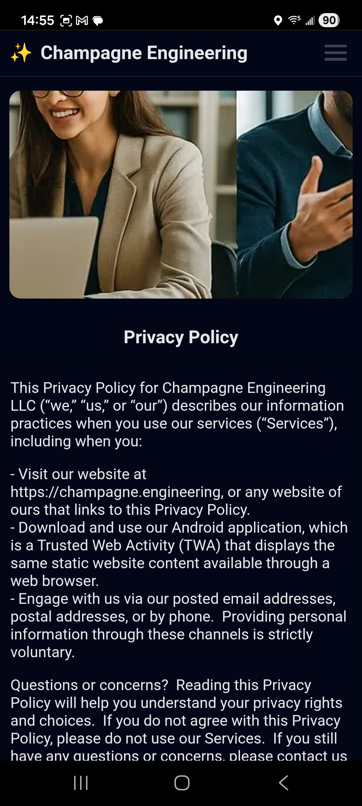

# Champagne Engineering

**Status:** 🟢 Production — version `3`

## Google Play

[View on Google Play](https://play.google.com/store/apps/details?id=engineering.champagne.twa)

## Overview

The official Android companion app for Champagne Engineering.

It provides quick access to the Champagne Engineering website and common destinations from your home screen.

## Features

- Quick access to the Champagne Engineering website
- Home-screen shortcuts for Services, Contact, and Privacy Policy

## Screenshots

  
  
  
  
  

## Repository Purpose

This public repository is maintained for Champagne Engineering mobile application documentation, release notes, and issue tracking. It does not contain the application source code.

## Documentation

Additional documentation is available in the [docs](docs/) directory.

- [Release Notes](docs/release-notes.md)
- [Product Page](https://champagne.engineering/champagne-engineering-app)
- [Privacy Policy](https://champagne.engineering/privacy)
- [Terms of Service](https://champagne.engineering/tos)

## Support

Website: https://champagne.engineering

Email: support@champagne.engineering

## Copyright

© 2026 Champagne Engineering, LLC. All rights reserved.
